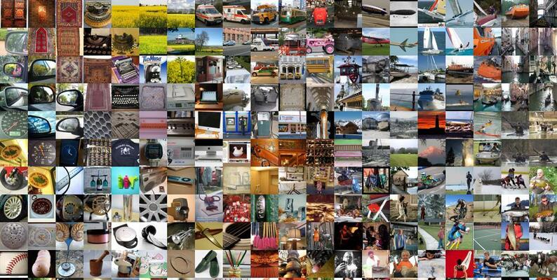
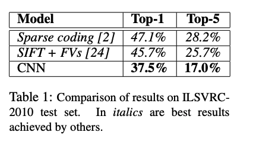
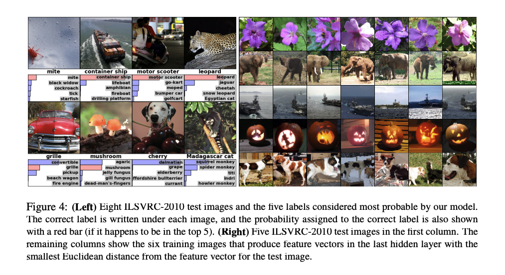
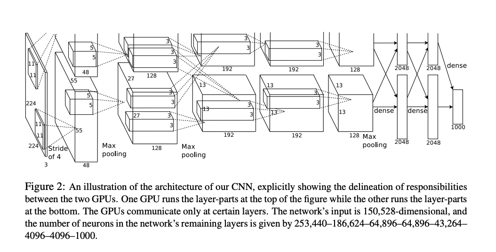

## 原文链接

- [Alex Krizhevsky etc. - ImageNet Classification with Deep Convolutional Neural Networks(2012)](https://papers.nips.cc/paper_files/paper/2012/hash/c399862d3b9d6b76c8436e924a68c45b-Abstract.html)

## 精读

`AlexNet`是深度学习浪潮的**奠基作之一**，发表于 2012 年。

### Pass 1

#### 标题

关键词：`ImageNet Classification`、`Deep Convolutional Neural Networks`

- [ImageNet](https://www.image-net.org/)是当时计算机视觉领域最大的一个图像数据集，最初大概包含 100 万张，1000 多个类别的各种各样的图像.

  

- `Deep Convolutional Neural Networks`

> **卷积神经网络**（CNN）是为处理图像数据而设计的神经网络，是一类包含卷积计算且具有深度结构的神经网络，是深度学习的代表算法之一。典型的 CNN 包含 3 个部分：
>
> - 卷积层：负责提取图像中的局部特征。
> - 池化层：大幅降低参数量，防止过拟合。
> - 全连接层：输出结果。

`深度卷积神经网络（DCNN）`顾名思义就是具有更深层次结构的 CNN。

#### 摘要

::: info 第一句

我们训练了一个大型的深度卷积神经网络，将 ImageNet LSVRC-2010 竞赛中的 120 万张高分辨率图像分为 1000 个不同的类别。

**首先交代了自己团队做的事情**。

:::

::: info 第二句

在测试集上，我们的 top-1 和 top-5 的错误率分别为 37.5% 和 17.0%，大大优于之前的工作成果。

**交代团队做的事情所产生的结果**：比前人的工作成果要好 😄。

:::

::: info 第三句

该神经网络有 6000 万个参数和 65 万个神经元，由五个卷积层和一些 Max-pooling 层、三个全连接层组成。

**交代团队搭建的神经网络模型**。

:::

::: info 第四、五句

为了加快训练速度，我们使用了非饱和神经元和非常高效的 GPU 实现卷积操作。

为了减少全连接层的过度拟合，我们采用了一种最近开发的正则化方法，即 "dropout"，事实证明这种方法非常有效。

**交代团队做的一些实验**。

:::

::: info 最后一句

我们还用该模型的一个变体参加了 ILSVRC-2012 竞赛，并以得到了一个 15.3% 的 top-5 测试错误率，而第二名的测试错误率为 26.2%。

**交代团队做的事情和其他人所做的成果形成了一定差距**。

:::

::: tip 总结

简单来说，就是作者团队训练了一个很大的神经网络，在 ImageNet 数据集上具有很好的表现（和别人的成果形成了一定的差距）。来自大佬的炫耀 😎。

:::

#### 结论

这篇文章最后没有结论，而是一个讨论。通常来讲，结论与摘要更相关，是对整篇文章的一个总结，而讨论可能就是吐吐槽，然后讲讲未来会做什么等等。

::: info 第一、二、三、四句

我们的研究结果表明，大型深度卷积神经网络能够通过纯粹的监督学习，在极具挑战性的数据集上取得破纪录的结果。

值得注意的是，如果去掉一个卷积层，我们的网络性能就会下降。例如，移除任何一个中间层都会导致网络的最高性能下降约 2%。因此，深度对于实现我们的结果确实非常重要。

为了简化实验，我们没有使用任何无监督预训练，尽管我们希望它能有所帮助，尤其是当我们获得足够的计算能力，可以在不相应增加标注数据量的情况下显著扩大网络规模时。

到目前为止，随着网络规模的扩大和训练时间的延长，我们的结果有所改善，但要与人类视觉系统的时空下通路相匹配，我们仍有许多数量级的工作要做。

**交代了作者团队视角下的结论**。

1. 实际上不能说去掉中间的一个卷积层之后，性能下降，就一定是深度的原因，或许是搜参没搜够。因此更完整的结论是要考虑更全面一些。
2. 在当时训练深度神经网络还是一件比较困难的事情，因此在训练前通常都会拿一些没有标注的图像对模型进行预热，让模型的权重参数处在一个较好的范围以后再往下训练。而作者团队表示没有使用这种方式，只是基于有标注的数据集训练模型，证明了在有监督学习上，只要神经网络模型够大，一样可以获得比传统机器学习更好的效果。

:::

::: info 最后一句

最终，我们希望在视频序列中使用大型深度卷积网络，因为在视频序列中，时间结构提供了非常有用的信息，而这些信息在静态图像中缺失或不明显。

**交代了作者团队未来想要做的事情**。

:::

#### 图表

::: tip 总结

通过上述第一遍的阅读，大致了解到这篇文章是构建了一个很大的卷积神经网络，并且在 ImageNet 数据集上得到了比同行更好效果。

:::

### Pass 2

#### 导言

::: info 第一段

目前的物体识别方法主要使用机器学习方法。为了提高它们的性能，我们可以收集更大的数据集，构建更强大的模型，并使用更好的技术来防止过拟合。直到最近，标注图像的数据集还比较小--大约只有几万张图像（例如，NORB [16]、Caltech-101/256 [8, 9] 和 CIFAR-10/100 [12]）。这种规模的数据集可以很好地解决简单的识别任务，尤其是在使用标签保护变换的情况下。例如，目前 MNIST 数字识别任务的最佳错误率（<0.3%）接近人类的表现 [4]。但现实环境中的物体具有相当大的可变性，因此要学会识别这些物体，必须使用更大的训练集。事实上，小型图像数据集的缺点已得到广泛认可（如 Pinto 等人 [21]），但直到最近才有可能收集到包含数百万张图像的标注数据集。新的大型数据集包括 LabelMe [23] 和 ImageNet [6]，前者由数十万张完全分割的图像组成，后者由超过 22,000 个类别的 1,500 多万张带标签的高分辨率图像组成。

**交代了当时机器学习是主流的方法，并且介绍了大家都在关心的事情——收集更多的数据以提高模型的性能，并且表示了对 ImageNet 数据集的赞美之意。**

在当时使用正则方法是防止模型过拟合的重要手段，但是现在看来正则化好像并不是最为关键的，最关键的是**神经网络的设计**，如何在没有正则的情况下，设计出一个好的神经网络结构以达到同样具有较好的泛化能力是值得讨论的事情。

:::

::: info 第二、三段

要从数百万张图像中了解成千上万个物体，我们需要一个学习能力强大的模型。然而，物体识别任务的巨大复杂性意味着，即使是像 ImageNet 这样庞大的数据集也无法解决这个问题，因此我们的模型还应该拥有大量的先验知识，以弥补我们所没有的数据。卷积神经网络（CNN）就是这样一类模型 [16, 11, 13, 18, 15, 22, 26]。它们的容量可以通过改变深度和广度来控制，而且它们还对图像的性质（即统计数据的静止性和像素依赖性的位置性）做出了强有力且基本正确的假设。因此，与具有类似大小层的标准前馈神经网络相比，CNN 的连接和参数要少得多，因此更容易训练，而其理论上的最佳性能可能只会稍差一些。

尽管 CNN 具有诱人的品质，尽管其局部架构相对高效，但将其大规模应用于高分辨率图像的成本仍然过高、 但要将其大规模应用于高分辨率图像，其成本仍然高得令人望而却步。幸运的是，目前的 GPU 搭配高度优化的二维卷积实现，其足够强大，可以帮助训练规模巨大的 CNN，而最近的数据集（如 ImageNet 等最新数据集）包含足够多的标注示例，可在不出现严重过拟合的情况下训练此类模型。

**交代 CNN 模型的强悍之处以及当下 GPU 可以很好的训练一个很深的 CNN。**（真是满眼都是 CNN😍）

在当时大家做物体识别所用的主流方法并不是 CNN，但作者在导言里只提 CNN，体现了作者的狂傲（bushi）。在自己写导言部分时更好的做法应该是先提当下主流的一些方法，并与自己的方法做一些对比。

:::

::: info 第四段

本文的具体贡献如下：我们在 ILSVRC-2010 和 ILSVRC-2012 竞赛 [2] 中使用的 ImageNet 子集上训练了迄今为止最大的卷积神经网络之一，并在这些数据集上取得了迄今为止的最佳结果。我们编写了高度优化的二维卷积和训练卷积神经网络固有的所有其他操作的 GPU 实现，并将其公开发布 1。我们的网络包含许多新颖独特的特性，这些特性提高了网络的性能，缩短了训练时间，详情请参见第 3 节。我们的网络规模庞大，即使有 120 万个标注训练数据，过拟合也是个大问题。因此，我们使用了几种有效的技术来防止过拟合。第 4 节将对此进行介绍。我们的最终网络包含五个卷积层和三个全连接层，这个深度似乎很重要：我们发现，移除任何一个卷积层（每个卷积层都有一个全连接层），都会导致网络的过度拟合。卷积层（每个卷积层所包含的参数不超过模型参数的 1%）都会导致性能下降。

**交代了整篇文章的结构，做了什么事等等，并且说明了作者团队所做的创新的地方，会在第三章、第四章详细讲**。

因此，作为一个研究者来讲，如果仅仅是整合很多方法作出一个结果可能并不能够吸引到很多引用量，研究者真正要做的事情一定是提出新的创新方法（也就是实实在在对这个世界产生贡献）。

:::

::: info 最后一段

归根结底，网络的规模主要受限于当前 GPU 的内存容量和我们愿意忍受的训练时间。我们的网络在两块 GTX 580 3GB GPU 上的训练时间为五到六天。我们的所有实验都表明，只需等待更快的 GPU 和更大的数据集出现，我们的结果就能得到改善。

**交代作者团队的实验过程**。事实上，工程性的工作只是脑力劳动中的体力劳动，在真正的研究者眼里可能并不是最重要的事情。

:::

::: tip 总结

在写导言部分时要对背景以及当前主流的一些方法做一定的介绍，其次最核心的是要突出自己团队所做的创新性的工作，工程性工作可以略带一笔。

:::

#### 数据集

::: info 第一、二段

ImageNet 是一个由 1,500 多万张带标签的高分辨率图像组成的数据集，分属约 22,000 个类别。这些图像从网络上收集而来，并由人类标注者使用亚马逊的 Mechanical Turk 众包工具进行标注。从 2010 年开始，作为 "帕斯卡视觉对象挑战赛 "的一部分，一项名为 "ImageNet 大规模视觉识别挑战赛"（ILSVRC）的年度竞赛一直在进行。ILSVRC 使用 ImageNet 的一个子集，每个子集有大约 1000 张图片，每张图片有 1000 个类别。1000 个类别。总共有大约 120 万张训练图像、5 万张验证图像和 150,000 张测试图像。

ILSVRC-2010 是唯一一个有测试集标签的 ILSVRC 版本，因此我们的大部分实验都是在这个版本上进行的。由于我们的模型也参加了 ILSVRC-2012 竞赛，因此在第 6 节中，我们也报告了这一版本数据集的结果。在 ImageNet 上，通常会报告两种错误率： top-1 和 top-5, 其中，top-5 错误率是指正确标签不在模型认为最有可能的五个标签之列的测试图像的分数。

**交代 ImageNet 数据集以及作者团队所使用的具体版本数据集**。

:::

::: info 第三段

ImageNet 由不同分辨率的图像组成，而我们的系统要求输入维度恒定。因此，我们对图像进行了下采样，使其分辨率固定为 256 × 256。对于矩形图像，我们首先重新缩放图像，使较短的一边长度为 256，然后从得到的图像中裁剪出 256×256 的中心区域。除了从每个像素中减去训练集的平均值之外，我们没有对图像进行任何其他预处理。因此，我们根据像素的（居中）原始 RGB 值对网络进行了训练。

**交代作者团队对原始数据集的处理**。

最重要的是最后一句话！作者提到自己团队输入 CNN 中的是原始图像，而没有使用经过特征化的图像数据集，这实际上正好是 CNN 具有提取图像特征这一强悍功能的强有力证明。并且这种端到端的训练方法实际上在后来深度学习领域中是非常流行的。端到端的训练流程意味着以前数十年间特别麻烦的特征工程在深度学习领域是可以实现**自动化**的。

可能碍于历史的局限性，作者只简单地提到了自己团队是这样做的，但并没有真正意识到最重要的亮点。😄

:::

#### 网络架构

::: info 第一段

我们的网络结构如图 2 所示。它包含八个学习层：五个卷积层和三个全连接层。下面，我们将介绍我们的网络架构的一些新颖或不寻常的 网络架构的一些新颖或不寻常的特点。第 3.1-3.4 节根据我们对其重要性的估计进行了排序。最重要的排在前面。

**交代作者团队创建的神经网络架构图以及所做的一些创新性工作**

:::

::: info 3.1 节 ReLU 非线性

通常在标准的神经网络中激活函数多是$f(x)=tanh(x)$或$f(x)=(1+e^{-x})^{-1}$，就梯度下降的训练时间而言，这些饱和的非线性激活函数要比非饱和的非线性激活函数（$f(x)=max(0, x)$）慢得多。继Nair和Hinton[20]之后，我们将具有这种非线性的神经元称为整流线性单元（ReLU）。使用 ReLU 的深度卷积神经网络的训练速度比使用$tanh$单元的等效神经网络快几倍。如图 1 所示，该图显示了在特定四层卷积网络的 CIFAR-10 数据集上达到 25% 训练误差所需的迭代次数。

:::
