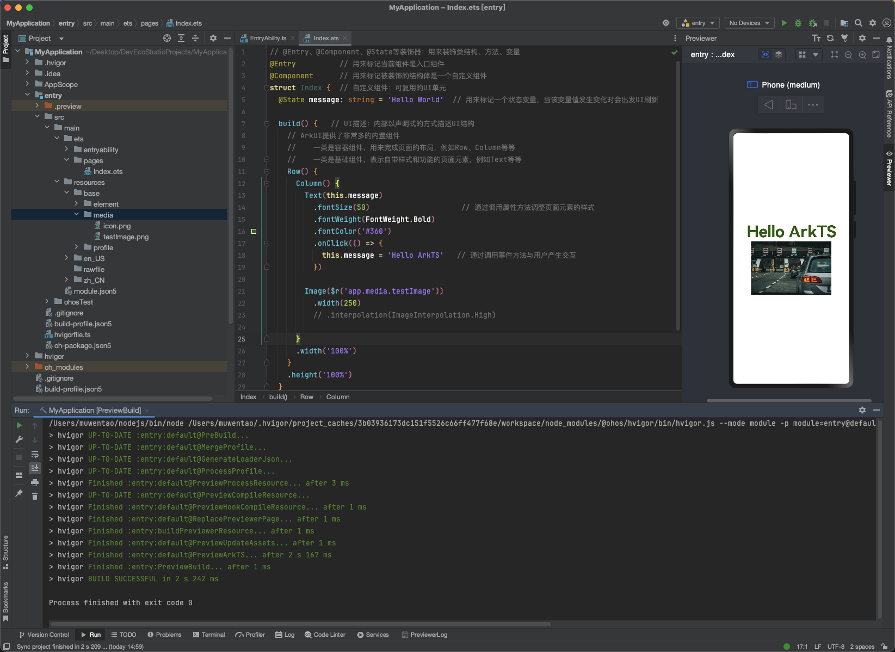
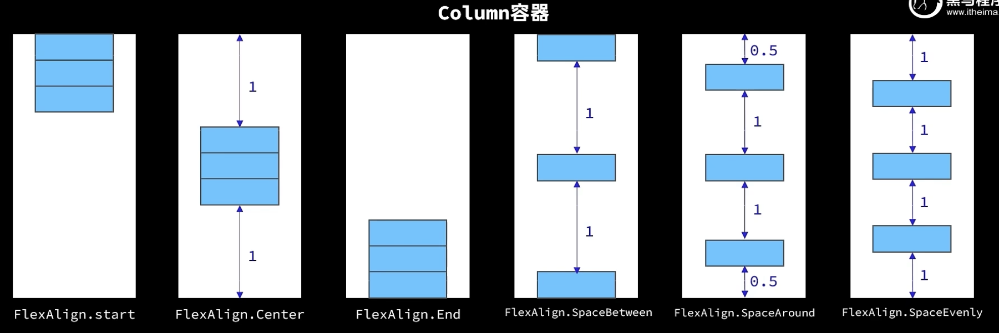
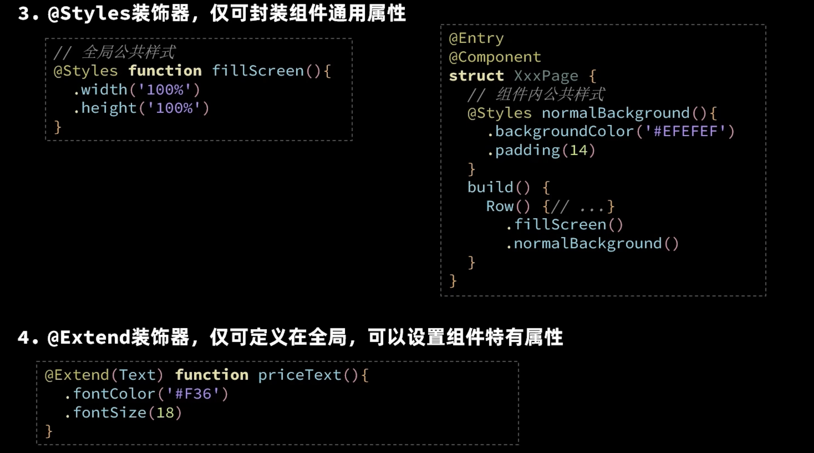

## 背景介绍

- [鸿蒙官网](https://www.harmonyos.com/)
- [华为开发者官网](https://developer.huawei.com/consumer/cn/)

**鸿蒙开发**主要是开发移动端应用程序的，其所使用的主要语言是`ArkTS`，这是基于`TypeScript`的一门具有**声明式 UI**、**状态管理**等特性的编程语言，这使得使用`ArkTS`具有开发效率高、开发体验好等优点。


### 基础示例



## ArkUI 组件

### Image：图片显示组件

- 声明`Image`组件并设置图片源：`Image(src: string|PixelMap|Resource)`

  - `string`格式，通常用来加载网络图片：`Image('https://xxx.png')`。加载网络图片需要申请网络访问权限：`ohos.permission.INTERNET`
  - `PixelMap`格式，可以加载像素图，通常用在图片编辑中：`Image(pixelMapObject)`
  - `Resource`格式，通常用来加载本地图片，是最常用的加载图片的方式：
    - `Image($r('app.media.mate60'))`：加载*resources/base/media/mate60.png*图片；**可以省略后缀名**。
    - `Image($rawfile('mate60.png'))`：加载*resources/rawfile/mate60.png*图片；**不可以省略后缀名**。

- 通过给图片添加属性设置图片组件样式，例如：

  ```ts
  Image($r("app.media.icon"))
    .width(100) // 宽度
    .height(120) // 高度
    .borderRadius(10) // 圆角边框
    .interpolation(ImageInterpolation.High); // 图片插值
  ```

### Text：文字组件

- 声明`Text`组件并设置文本内容：`Text(content?: string|Resource)`

  - `string`格式，直接填写文本内容：`Text('Hello World')`
  - `Resource`格式，读取本地限定词目录下的`element/string.json`文件：`Text($r('app.string.text_label'))`；

- 添加文本组件属性示例：

  ```ts
  Text("注册")
    .lineHeight(32) // 行高
    .fontSize(20) // 字体大小
    .fontColor("#ff1876f8") // 字体颜色
    .fontWeight(FontWeight.Medium); // 字体粗细
  ```

### TextInput：输入框组件

- 声明`TextInput`组件：`TextInput({placeholder?: ResourceStr, text?: ResourceStr})`

  - `ResourceStr`：表示接受字符串或 Resource 格式输入。
  - `placeholder`：输入框无输入时的提示文本
  - `text`：输入框当前的文本内容

- 添加文本输入框组件的属性方法示例：

  ```ts
  TextInput({ text: "当前文本内容" })
    .width(150) // 宽度
    .height(30) // 高度
    .backgroundColor("FFF") // 背景色
    .type(InputType.Password) // 输入框类型
    .onChange((value) => {
      // value表示用户输入的文本内容
    });
  
  /* 输入框类型：
  			Normal: 基本输入模式，支持输入数字、字母、下划线、空格、特殊字符。
  			Password：密码输入模式，支持输入数字、字母、下划线、空格、特殊字符。
  			Email：邮箱地址输入模式，支持数字、字母、下划线以及@字符。
  			Number：纯数字输入模式。
  			PhoneNumber：电话号码输入模式，支持输入数字、+、-、*、#，长度不限。
  */
  ```

### Button：按钮组件

- 声明`Button`组件并设置`label`：`Button(label?: ResourceStr)`

  - 文字型按钮：`Button("点击")`

  - 自定义按钮：

    ```ts
    Button(){
      Image($r('app.media.search'))
      	.width(20)
        .margin(10)
    }
    ```

- 添加属性和事件方法示例：

  ```ts
  Button("Click")
    .width(100)
    .height(30)
    .type(ButtonType.Normal) // 按钮类型
    .onClick(() => {
      // 处理点击事件
    });
  
  /* 按钮类型：
      Capsule：胶囊型按钮（圆角默认为高度的一半）
      Circle：圆形按钮
      Normal：普通按钮（默认不带圆角）
  
  */
  ```

### Slider：滑动条组件

- 声明滑动条组件：`Slider(options?: SliderOptions)`

  ```ts
  Slider({
    min: 0, // 最小值
    max: 100, // 最大值
    value: 30, // 当前值
    step: 10, // 滑动步长
    style: SliderStyle.OutSet, // OutSet是默认值，InSet表示滑块在滑动条的里面
    direction: Axis.Horizontal, // Horizaontal是默认值，Vertical表示竖直方向
    reverse: false, // 是否反向滑动（调换最小值及最大值的方向）
  })
    .width("90%")
    .showTips(true) // 是否显示value百分比提示
    .blockColor("#360") // 滑块的颜色
    .onChange((value) => {
      // value是当前滑块值
    });
  ```

### Row、Column：布局组件

- `Row`、`Column`组件主要用做页面的布局，这两个组件都有其相应的**主轴**和**交叉轴**，其中`Row`是按照水平排列的方式进行布局的，主轴是水平方向，交叉轴是垂直方向。`Column`是按照竖直排列的方式进行布局，主轴是垂直方向，交叉轴是水平方向。

- 这两个组件都可以使用`justifyContent`属性方法设置沿**主轴**方向的对齐方式，参数是`FlexAlign`枚举。

  - Column 容器的主轴对齐方式：

  - Row 容器的主轴对齐方式：

- 使用`alignItems`属性方法设置两个组件沿**交叉轴**的对齐方式，其中`Row`容器参数使用`VerticalAlign`枚举，而`Column`容器使用`HorizontalAlign`枚举。

  - 两种容器的交叉轴对齐方式：

- 在声明两种组件时，可以同时传入`space`选项控制组件中页面元素的间距。

### 循环渲染语法


### List：列表组件

- `List`是一种复杂的容器组件，具有以下特点：
  - 列表项`ListItem`数量过多超出屏幕以后，会自动提供滚动功能。
  - 列表项`ListItem`既可以纵向排列，也可以横向排列

```ts
List( {space: 8 }) {
  ForEach(
  	this.items,
    (items: Item) => {
      ListItem() {
        // ListItem内部只支持一个根组件
       	...
      }
    }
  )
}
.width('100%')
.height("100%")   // 列表组件一定要设置高度，
.layoutWeight(1)  // layoutWeight这是布局所占权重，其他是0，所以除其他以外占用剩余空间
```

### Blank：空白组件

- `Blank`组件可以简单的实现某些布局效果，其作用是占用剩余的所有空间。

### 抽取公共代码

- 可以使用`export/import`的方式导入导出自定义组件，实现组件的复用。组件可以定义成员变量，使用时传入相应的值即可。
- 还可以使用`@Builder`装饰器创建自定义构建函数（可以传参），实现抽取公共代码的功能，使页面整体代码结构更加有组织。如果是全局构建函数要在`@Builder`装饰器后加`function`关键字。

- `@Styles`装饰器可以创建自定义公共样式。 如果是全局的公共样式要在`@Styles`装饰器后加`function`关键字。另外自定义公共样式里只能包含公共的样式。

- 某些组件特有的样式代码也可以被提取，使用`@Extend`装饰器即可，

  ```ts
  @Extend(Text) function priceText() {
  	.fontColor("#360")
    .fontSize(18)
  }
  ```

  

  

## 状态管理

### @State装饰器

在声明式UI中，**状态**能够驱动**视图**进行自动更新。


状态（State）：指驱动视图更新的数据（被装饰器修饰的变量）。

视图（View）：基于UI描述渲染得到的用户界面。

视图依赖状态变量，当状态变量发生变化时，视图会自动渲染更新，使用新的状态变量丰富页面。这种机制就是**状态管理**。

::: tip 使用`@State`需要注意的几点

+ `@State`装饰器修饰的变量必须初始化，不能为空值。
+ `@State`装饰器支持的数据类型是有限的，其仅支持`Object`、`class`、`string`、`number`、`boolean`、`enum`类型及这些类型的**数组**。如`any`、`union`等复杂的数据类型`@State`装饰器并不支持。
+ 嵌套类型以及修改数组中的对象属性是无法触发视图更新的。而在数组中添加、删除元素或者改变对象引用时可以触发视图更新。

:::

### @Prop、@Link装饰器

`@Prop`装饰器、`@Link`装饰器可以实现父子组件之间的数据同步。 

在子组件中通过`@Prop`装饰器修饰变量，可以实现父组件`@State`状态变量的**单向同步**，即父组件中修改会影响子组件，子组件不会影响父组件。

在子组件中通过`@Link`装饰器修饰变量，可以实现父组件`@State`状态变量的**双向同步**，即父组件和自组件同时共享一份数据。

::: tip 注意

+ 使用`@Prop`和`@Link`这两个装饰器修饰的变量不能初始化。
+ `@Prop`装饰器只支持`string`、`number`、`boolean`、`enum`类型，如果父组件的状态变量是一个对象，子组件可以接受对象属性，但`@Prop`不能修饰数组、`any`等类型。
+ 使用`@Link`装饰器，父组件向子组件传值时必须传递**引用**，即必须使用`$`作为变量前缀。
+ `@Link`装饰器要求父子组件的类型必须一致，支持`string`、`number`、`boolean`、`enum`、`object`、`class`以及他们的数组。嵌套类型以及修改数组中的对象属性是无法触发视图更新的。而在数组中添加、删除元素或者改变对象引用时可以触发视图更新。和`@State`装饰器保持一致，区别就是`@Link`用在子组件中。

:::

`@Provide`和`@Consume`可以**跨组件**提供类似于`@State`和`@Link`的双向同步。这意味着父组件和孙子组件可以共享同一份数据。并且父组件不需要传递状态变量给子组件了，这意味着代码书写量会减少，但同时会带来一定损耗，因此推荐能用`@Prop`和`@Link`解决就用这两者解决。

如果子组件使用父组件的数据，但不做修改就使用`@Prop`装饰器。如果子组件使用父组件的数据并做修改就使用`@Link`装饰器。


### @Observed、@ObjectLink装饰器

`@Observed`、`@ObjectLink`装饰器用于在**嵌套对象**或**数组元素为对象**的场景中进行双向数据同步。


## 页面路由

页面路由具体是指在应用程序中不同页面之间的跳转和数据传递实现。

页面使用栈结构实现显示和返回等等。HarmonyOS页面栈的最大容量上限为**32**个页面，使用`router.clear()`方法可以清空页面栈，释放内存。

`Router`有两种页面跳转模式：

+ `router.pushUrl()`：目标页不会定寰当前页，而是压入页面栈，可以使用`router.back()`返回当前页面。
+ `router.replaceUrl()`：目标页替换当前页面，当前页会被销毁并释放资源，因此无法返回。

`Router`的两种页面示例模式：

+ `Standard`：标准实例模式，每次跳转都会新建一个目标页并压入栈顶，默认就是这种模式。
+ `Single`：单实例模式，如果目标页已经在栈中，则离栈顶最近的同Url页面会被移动到栈顶并重新加载。


## 动画


 


