## 背景介绍

**鸿蒙开发**所使用的主要语言是华为自研的`ArkTS`开发语言，这是基于`TypeScript`的一门具有**声明式 UI**、**状态管理**等特性的编程语言，这使得使用`ArkTS`具有开发效率高、开发体验好等优点。

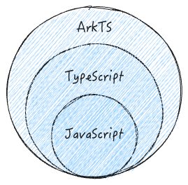

### Hello ArkTS 示例


### 工程级目录结构解析

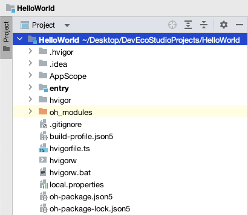

其中详细如下：

- `AppScope`中存放应用全局所需要的资源文件。
- `entry`是应用的主模块，存放 HarmonyOS 应用的代码、资源等。
- `oh_modules`是工程的依赖包，存放工程依赖的源文件。
- `build-profile.json5`是工程级配置信息，包括签名、产品配置等。
- `hvigorfile.ts`是工程级编译构建任务脚本，`hvigor`是基于任务管理机制实现的一款全新的自动化构建工具，主要提供任务注册编排，工程模型管理、配置管理等核心能力。
- `oh-package.json5`是工程级依赖配置文件，用于记录引入包的配置信息。

在`AppScope`，其中有`resources`文件夹和工程级配置文件`app.json5`。`AppScope>resources>base`中包含`element`和`media`两个文件夹，

- 其中`element`文件夹主要存放公共的字符串、布局文件等资源。
- `media`存放全局公共的多媒体资源文件。

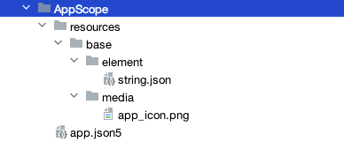

### 模块级目录结构解析


`entry>src`目录中主要包含总的`main`文件夹，单元测试目录`ohosTest`，以及**模块级的配置文件**。

- `main`文件夹中，`ets文件夹`用于存放 ets 代码，`resources文件夹`存放模块内的多媒体及布局文件等，`module.json5`文件为模块的配置文件。
- `build-profile.json5`是模块级配置信息，包括编译构建配置项。
- `hvigorfile.ts`文件是模块级构建脚本。
- `oh-package.json5`是模块级依赖配置信息文件。

进入`src>main>ets`目录中，其分为`entryability`、`pages`两个文件夹。

- `entryability`存放`ability`文件，用于**当前 ability**应用逻辑和生命周期管理。
- `pages`存放 UI 界面相关代码文件，初始会生成一个 Index 页面。

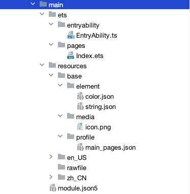

- `resources`目录下存放模块公共的多媒体、字符串及布局文件等资源，分别存放在`element`、`media`文件夹中。`en_US`和`zh_CN`是国际化配置相关资源存放目录。

### 几个重要的配置文件

#### app.json5

`AppScope>app.json5`是应用的全局的配置文件，用于存放应用公共的配置信息。

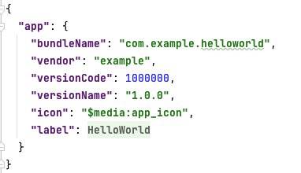

其中配置信息如下：

- `bundleName`是包名。
- `vendor`是应用程序供应商。
- `versionCode`是用于区分应用版本。
- `versionName`是版本号。
- `icon`对应于应用的显示图标。
- `label`是应用名。

#### modulu.json5

`entry>src>main>module.json5`是模块的配置文件，包含当前模块的配置信息。


其中`module`对应的是模块的配置信息，一个模块对应一个打包后的`hap`包，hap 包全称是**HarmonyOS Ability Package**，其中包含了**ability**、**第三方库**、**资源和配置文件**。其具体属性及其描述可以参照下表。

|        属性         |                                                                       描述                                                                       |
| :-----------------: | :----------------------------------------------------------------------------------------------------------------------------------------------: |
|        name         |  该标签标识当前 module 的名字，module 打包成 hap 后，表示 hap 的名称，标签值采用字符串表示（最大长度`31`个字节），该名称在整个应用要**唯一**。   |
|        type         |                                          表示模块的类型，类型有三种，分别是`entry`、`feature`和`har`。                                           |
|      srcEntry       |                                                             当前模块的入口文件路径。                                                             |
|     description     |                                                               当前模块的描述信息。                                                               |
|     mainElement     |      该标签标识 hap 的**入口 ability 名称**或者**extension 名称**。只有配置为 mainElement 的 ability 或者 extension 才允许在服务中心露出。       |
|     deviceTypes     |                                        该标签标识 hap 可以运行在哪类设备上，标签值采用字符串数组的表示。                                         |
| deliveryWithInstall | 标识当前 Module 是否在用户主动安装的时候安装，表示该 Module 对应的 HAP 是否跟随应用一起安装。`true`：主动安装时安装。`false`：主动安装时不安装。 |
|  installationFree   |                标识当前 Module 是否支持免安装特性。`true`：表示支持免安装特性，且符合免安装约束。`false`：表示不支持免安装特性。                 |
|        pages        |                                       对应的是`main_pages.json`文件，用于配置 ability 中用到的 page 信息。                                       |
|      abilities      |                           是一个**数组**，存放当前模块中**所有的 ability 元能力**的配置信息，其中可以有多个 ability。                            |

对于`abilities`中每一个 ability 的属性项，其描述信息如下表。

|         属性          |                                                                      描述                                                                      |
| :-------------------: | :--------------------------------------------------------------------------------------------------------------------------------------------: |
|         name          |                   该标签标识当前 ability 的逻辑名，该名称**在整个应用要唯一**，标签值采用字符串表示（最大长度`127`个字节）。                   |
|       srcEntry        |                                                            ability 的入口代码路径。                                                            |
|      description      |                                                              ability 的描述信息。                                                              |
|         icon          | ability 的图标。该标签标识 ability 图标，标签值为资源文件的索引。该标签可缺省，缺省值为空。如果 ability 被配置为 MainElement，该标签必须配置。 |
|         label         |                                                               ability 的标签名。                                                               |
|    startWindowIcon    |                                                                启动页面的图标。                                                                |
| startWindowBackground |                                                               启动页面的背景色。                                                               |
|        visible        |                      ability 是否可以被其他应用程序调用，`true`表示可以被其它应用调用， `false`表示不可以被其它应用调用。                      |
|        skills         |                             标识能够接收的意图的 action 值的集合，取值通常为系统预定义的 action 值，也允许自定义。                             |
|       entities        |                                                     标识能够接收 Want 的 Entity 值的集合。                                                     |
|        actions        |                            标识能够接收的 Want 的 Action 值的集合，取值通常为系统预定义的 action 值，也允许自定义。                            |

#### main_page.json5

`src/main/resources/base/profile/main_pages.json`文件保存的是页面 page 的路径配置信息，所有需要进行路由跳转的 page 页面都要在这里进行配置。


## ArkUI

`ArkUI`是用于构建分布式应用界面的**声明式**UI 开发框架，包含丰富的 UI 组件以及实时界面预览工具，使用一套`ArkTS`API 就可以开发能够多设备部署的工程项目。

### 基本概念

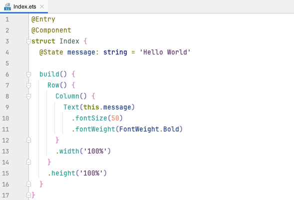

- **装饰器**：用于装饰类、结构、方法和变量的标记，赋予其特殊含义。如

  - `@Entry`表示页面的默认入口组件。当页面被加载时，将首先创建并呈现被`@Entry`修饰的组件。
  - `@Component`表示自定义组件，自定义组件是一个可重用的结构代码块，用于和 ArkUI 提供的丰富内置组件相区别；需要结合`struct`关键字表示该代码块具有组件化能力，在自定义组件中必须包含`build`函数。
  - `@State`表示状态变量，被`@State`标记的变量发生改变时，视图 UI 会自动更新以重新渲染该变量的值到视图中。

- **UI 描述**：是指在`build`方法代码块中以声明式的方式描述 UI 结构。

- **内置组件**：ArkUI 提供的基础组件（如`Text`等）和容器组件（如`Row`、`Column`等）。
- **属性方法**：是指设置组件属性的方法。如`fontSize`、`fontWeight`等等。
- **事件方法**：是指设置组件对不同事件相应逻辑的方法。如`onChange`、`onClick`等等。

### 自定义组件声明周期

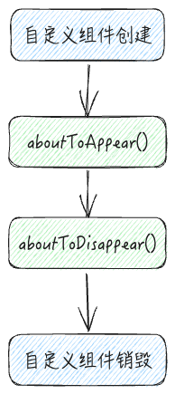

自定义组件声明周期是指自定义组件从创建到销毁的过程。ArkUI 提供了两个生命周期函数（系统自动调用，无法手动调用）：

- `aboutToAppear()`函数在自定义组件创建结束之后以及其`build`函数执行之前执行，可以在该函数中对 UI 中需要展示的数据进行初始化或者申请定时器资源等操作。
- `aboutToDisappear()`函数在自定义组件销毁时调用，可以在该函数中释放不再使用的资源，避免资源泄漏。

对于页面入口组件，`ArkUI`还提供了另外 3 个生命周期函数：

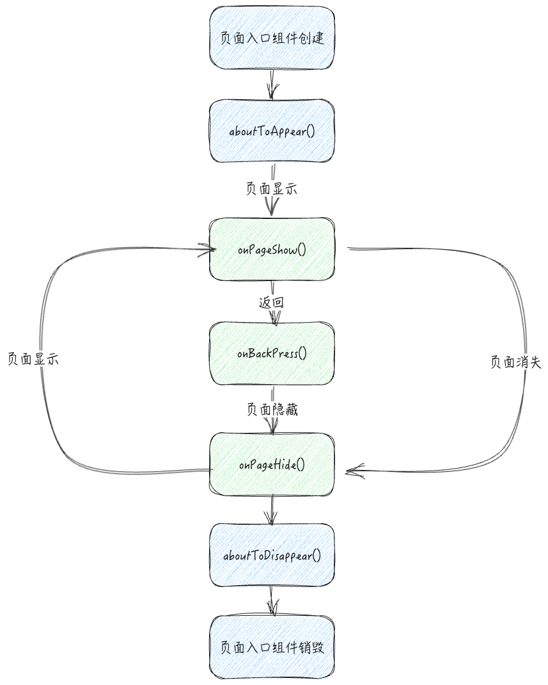

- `onPageShow()`：当页面进入前台显示时触发。
- `onBackPress()`：当用户点击返回按钮通过系统方式执行返回操作时触发。当该函数返回`true`时，表示页面自己处理返回逻辑，不进行页面返回。当该函数返回`false`时，表示由系统处理返回逻辑，默认为`false`。
- `onPageHide()`：当页面进入后台消失时触发。

### 条件渲染、循环渲染的语法


### 状态管理

#### @State 装饰器

在声明式 UI 中，**状态**能够驱动**视图**进行自动更新。


状态（State）：指驱动视图更新的数据（被装饰器修饰的变量）。

视图（View）：基于 UI 描述渲染得到的用户界面。

视图依赖状态变量，当状态变量发生变化时，视图会自动渲染更新，使用新的状态变量丰富页面。这种机制就是**状态管理**。

::: tip 使用`@State`需要注意的几点

- `@State`装饰器修饰的变量必须初始化，不能为空值。
- `@State`装饰器支持的数据类型是有限的，其仅支持`Object`、`class`、`string`、`number`、`boolean`、`enum`类型及这些类型的**数组**。如`any`、`union`等复杂的数据类型`@State`装饰器并不支持。
- 嵌套类型以及修改数组中的对象属性是无法触发视图更新的。而在数组中添加、删除元素或者改变对象引用时可以触发视图更新。

:::

#### @Prop、@Link 装饰器

`@Prop`装饰器、`@Link`装饰器可以实现父子组件之间的数据同步。

在子组件中通过`@Prop`装饰器修饰变量，可以实现父组件`@State`状态变量的**单向同步**，即父组件中修改会影响子组件，子组件不会影响父组件。

在子组件中通过`@Link`装饰器修饰变量，可以实现父组件`@State`状态变量的**双向同步**，即父组件和自组件同时共享一份数据，任何一方所做的修改都会反映给另一方。

::: tip 注意

- 使用`@Prop`和`@Link`这两个装饰器修饰的变量不能初始化。
- `@Prop`装饰器只支持`string`、`number`、`boolean`、`enum`类型，如果父组件的状态变量是一个对象，子组件可以接受对象属性，但`@Prop`不能修饰数组、`any`等类型。
- 使用`@Link`装饰器，**父组件向子组件传值时必须传递引用**，即必须使用`$`作为变量前缀。
- `@Link`装饰器要求父子组件的类型必须一致，支持`string`、`number`、`boolean`、`enum`、`object`、`class`以及他们的数组。嵌套类型以及修改数组中的对象属性是无法触发视图更新的。而在数组中添加、删除元素或者改变对象引用时可以触发视图更新。和`@State`装饰器保持一致，区别就是`@Link`用在子组件中。
- 使用`@Link`装饰器时，可以同时使用`@Watch(func)`装饰器完成对状态变量的监听，当状态变量发生改变时，可通过回调函数实现自定义逻辑。

:::

`@Provide`和`@Consume`可以**跨组件**提供类似于`@State`和`@Link`的双向同步。这意味着父组件和孙子组件可以共享同一份数据。并且父组件不需要传递状态变量给子组件了，这意味着代码书写量会减少，但同时会带来一定损耗，因此推荐能用`@Prop`和`@Link`解决就用这两者解决。

如果子组件使用父组件的数据，但不做修改就使用`@Prop`装饰器。如果子组件使用父组件的数据并做修改就使用`@Link`装饰器。

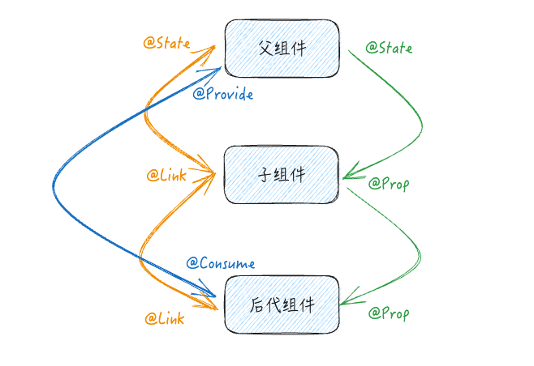

#### @Observed、@ObjectLink 装饰器

`@Observed`、`@ObjectLink`装饰器用于在**嵌套对象**或**数组元素为对象**的场景中进行双向数据同步。

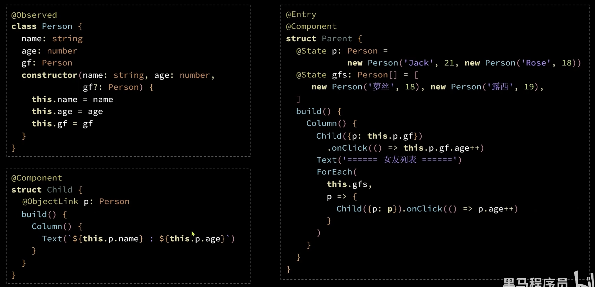

### 应用程序框架

#### UIAbility 基本概念

`UIAbility`是一种包含用户界面的应用组件，主要用于和用户进行交互。通常用户可以通过以下方式进入`UIAbility`：

- 点击桌面应用图标进入应用。
- 一个应用拉起另外一个应用，例如在图库应用中通过分享进入备忘录应用。
- 从最近任务列表中切回应用。

每一个`UIAbility`都对应于最近任务列表中的一个任务，`UIAbility`作为系统调度的单元，提供窗口用于界面绘制。一个应用可以有一个`UIAbility`，也可以有多个`UIAbility`，建议将一个独立的功能模块放在同一个`UIAbility`中。一个`UIAbility`可以对应多个页面，多个页面之间可以通过页面路由进行跳转。

#### UIAbility 内的页面跳转

[页面路由](https://developer.harmonyos.com/cn/docs/documentation/doc-references-V3/js-apis-router-0000001478061893-V3?catalogVersion=V3)具体是指在应用程序中不同页面之间的跳转和数据传递实现。

页面使用栈结构实现显示和返回等等。HarmonyOS 页面栈的最大容量上限为**32**个页面，使用`router.clear()`方法可以清空页面栈所有历史页面，释放内存，仅保留当前页面作为栈顶页面。

`Router`有两种页面跳转模式：

- `router.pushUrl()`：目标页不会替换当前页，而是压入页面栈。因此可以使用`router.back()`返回当前页面，在调用 router.back()方法之前，可以先调用`router.enableBackPageAlert()`方法开启页面返回询问对话框功能。关闭页面返回询问对话框功能，可以通过调用`router.disableAlertBeforeBackPage()`方法关闭该功能即可。

  ```ts
  router.enableBackPageAlert({
    message: "Message Info",
  });

  router.back();
  ```

- `router.replaceUrl()`：目标页替换当前页面，当前页会被销毁并释放资源，因此无法返回。

`Router`的两种页面示例模式：

- `Standard`：标准实例模式，每次跳转都会新建一个目标页并压入栈顶，默认就是这种模式。
- `Single`：单实例模式，如果目标页已经在栈中，则离栈顶最近的同 Url 页面会被移动到栈顶并重新加载。

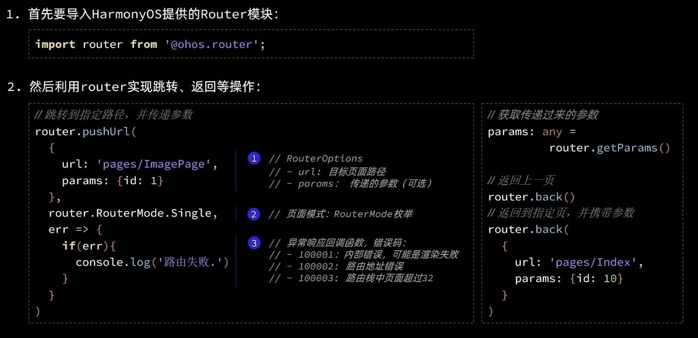

#### UIAbility 的生命周期

当用户打开、切换和退出应用时，应用中的 UIAbility 实例会在其生命周期的不同状态之间进行转换。`UIAbility`包含`Create`、`Foreground`、`Background`、`Destroy`四个状态。`WindowStageCreate`和`WindowStageDestroy`是 UIAbility 中管理 UI 界面功能的两个生命周期回调函数。

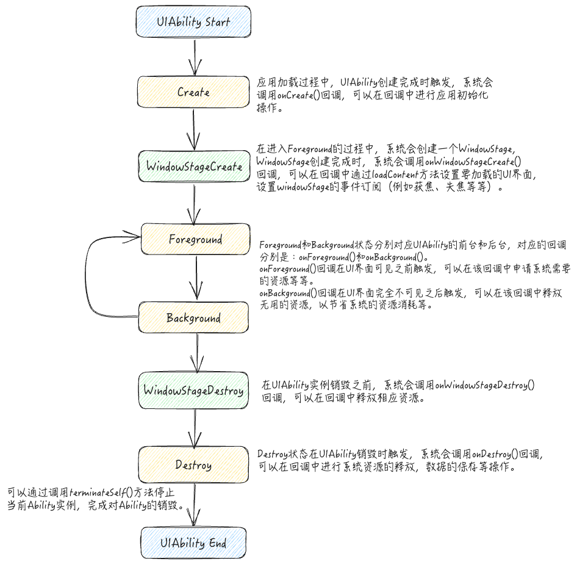

#### UIAbility 的启动模式

**UIAbility**当前支持`singleton`（单实例模式）、`multiton`（多实例模式）和`specified`（指定实例模式）3 种启动模式。启动模式的开发使用，配置`module.json5`文件中的“**launchType**”字段即可。

- **singleton（单实例模式）**：是默认情况下的启动模式。每次调用`startAbility()`方法时，如果应用进程中该类型的 UIAbility 实例已经存在，则复用系统中的 UIAbility 实例。系统中只存在唯一一个该 UIAbility 实例，即在最近任务列表中只存在一个该类型的 UIAbility 实例。
- **multiton（多实例模式）**：每次调用`startAbility()`方法时，都会在应用进程中**创建一个新的**该类型 UIAbility 实例。即在最近任务列表中可以看到有多个该类型的 UIAbility 实例。这种情况下可以将 UIAbility 配置为 multiton（多实例模式）。
- **specified（指定实例模式）**：针对一些特殊场景使用（例如文档应用中每次新建文档希望都能新建一个文档实例，重复打开一个已保存的文档希望打开的都是同一个文档实例）。[参考文档](https://developer.huawei.com/consumer/cn/training/course/slightMooc/C101667310940295021)
