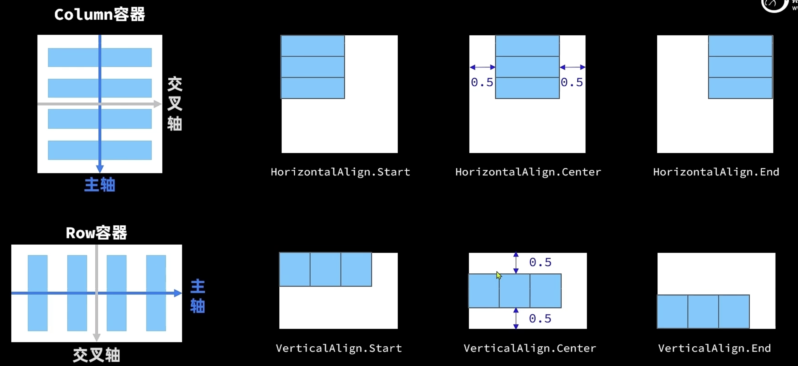
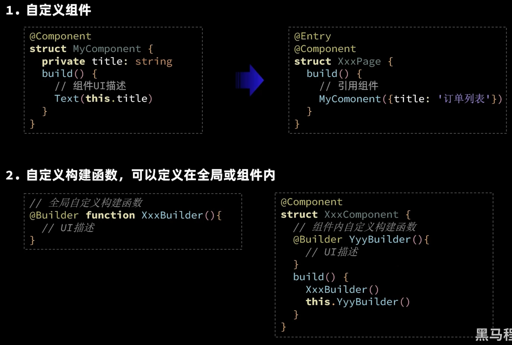

## 基础内置组件

### Image

用于渲染展示图片的组件，支持加载本地和网络图片

- 声明Image组件并设置图片源：`Image(src: string|PixelMap|Resource)`

  - `string`格式，通常用来加载网络图片：`Image('https://xxx.png')`。加载网络图片需要在`module.json5`文件中申请网络访问权限：

    ```ts
    "module": {
      "reqPermissions": [
        {"name": "ohos.permission.INTERNET"}
      ]
    }
    ```
  - `PixelMap`格式，可以加载像素图，通常用于读取或写入图像数据以及获取图像信息：`Image(pixelMapObject)`
  - `Resource`格式，通常用来加载本地图片，是最常用的加载图片的方式：

    - `Image($r('app.media.mate60'))`：加载*resources/base/media/mate60.png*图片；**可以省略后缀名**。
    - `Image($rawfile('mate60.png'))`：加载*resources/rawfile/mate60.png*图片；**不可以省略后缀名**。

- 通过给图片添加属性设置图片组件样式，例如：

  ```ts
  Image($r("app.media.icon"))
    .width(100) // 宽度
    .height(120) // 高度
    .borderRadius(10) // 圆角边框
    .interpolation(ImageInterpolation.High); // 图片插值
  ```

### Text

用于在界面展示文本信息，可以包含子组件Span。

- 声明`Text`组件并设置文本内容：`Text(content?: string|Resource)`

  - `string`格式，直接填写文本内容：`Text('Hello World')`
  - `Resource`格式，读取本地限定词目录下的`element/string.json`文件：`Text($r('app.string.text_label'))`；

- 添加文本组件属性示例：

  ```ts
  Text("注册")
    .lineHeight(32) // 行高
    .fontSize(20) // 字体大小
    .fontColor("#ff1876f8") // 字体颜色
    .fontWeight(FontWeight.Medium); // 字体粗细
  ```

### TextInput

输入单行文本并支持响应输入事件。

- 声明`TextInput`组件：`TextInput({placeholder?: ResourceStr, text?: ResourceStr})`

  - `ResourceStr`：表示接受字符串或 Resource 格式输入。
  - `placeholder`：输入框无输入时的提示文本
  - `text`：输入框当前的文本内容

- 添加文本输入框组件的属性方法示例：

  ```ts
  TextInput({ placeholder: "请输入文本", text: "当前文本内容" })
    .width(150) // 宽度
    .height(30) // 高度
    .backgroundColor("FFF") 	// 背景色
  	.maxLength(11)			// 最大长度为11
    .type(InputType.Password) // 输入框类型
    .onChange((value) => {
      // value表示用户输入的文本内容
    });
  
  /* 输入框类型：
  			Normal: 基本输入模式，支持输入数字、字母、下划线、空格、特殊字符。
  			Password：密码输入模式，支持输入数字、字母、下划线、空格、特殊字符。
  			Email：邮箱地址输入模式，支持数字、字母、下划线以及@字符。
  			Number：纯数字输入模式。
  			PhoneNumber：电话号码输入模式，支持输入数字、+、-、*、#，长度不限。
  */
  ```

### Button

用于响应点击的按钮组件。

- 声明`Button`组件并设置`label`：`Button(label?: ResourceStr)`

  - 文字型按钮：`Button("点击")`

  - 自定义按钮：

    ```ts
    Button(){
      Image($r('app.media.search'))
      	.width(20)
        .margin(10)
    }
    ```

- 添加属性和事件方法示例：

  ```ts
  Button("Click")
    .width(100)
    .height(30)
    .type(ButtonType.Normal) // 按钮类型
    .onClick(() => {
      // 处理点击事件
    });
  
  /* 按钮类型：
      Capsule：胶囊型按钮（圆角默认为高度的一半）
      Circle：圆形按钮
      Normal：普通按钮（默认不带圆角）
  
  */
  ```

### LoadingProgress

用于显示加载进展的组件。

比如应用的登录界面，当我们点击登录的时候，显示的“正在登录”的进度条状态。LoadingProgress的使用非常简单，只需要设置颜色和宽高就可以了。

```ts
LoadingProgress()
  .color(Color.Blue)
  .height(60)
  .width(60)
```


### Slider

滑动条组件

- 声明滑动条组件：`Slider(options?: SliderOptions)`

  ```ts
  Slider({
    min: 0, // 最小值
    max: 100, // 最大值
    value: 30, // 当前值
    step: 10, // 滑动步长
    style: SliderStyle.OutSet, // OutSet是默认值，InSet表示滑块在滑动条的里面
    direction: Axis.Horizontal, // Horizaontal是默认值，Vertical表示竖直方向
    reverse: false, // 是否反向滑动（调换最小值及最大值的方向）
  })
    .width("90%")
    .showTips(true) // 是否显示value百分比提示
    .blockColor("#360") // 滑块的颜色
    .onChange((value) => {
      // value是当前滑块值
    });
  ```

### Video

[官方API](https://developer.harmonyos.com/cn/docs/documentation/doc-references-V3/ts-media-components-video-0000001427902484-V3?catalogVersion=V3)

### Web

[API文档](https://developer.harmonyos.com/cn/docs/documentation/doc-references/ts-basic-components-web-0000001333720957)

## 布局容器组件

### Row、Column

- `Row`、`Column`组件主要用做页面的线性布局，这两个组件都有其相应的**主轴**和**交叉轴**，其中`Row`是按照水平排列的方式进行布局的，主轴是水平方向，交叉轴是垂直方向。`Column`是按照竖直排列的方式进行布局，主轴是垂直方向，交叉轴是水平方向。

- 这两个组件都使用`justifyContent`属性方法设置沿**主轴**方向的对齐方式，参数是`FlexAlign`枚举。

  - Column 容器的主轴对齐方式：

  - Row 容器的主轴对齐方式：

- 使用`alignItems`属性方法设置两个组件沿**交叉轴**的对齐方式，其中`Row`容器参数使用`VerticalAlign`枚举，而`Column`容器使用`HorizontalAlign`枚举。

  - 两种容器的交叉轴对齐方式：

- 在声明两种组件时，可以同时传入`space`选项控制组件中页面元素的间距。

### List

常用的滚动类容器组件，包含一系列相同宽度的列表项，比较适合连续多行呈现同类型的数据。通常和子组件`ListItem`一起使用，按照垂直或水平方向线性排列。`List`具有以下特点：

- 列表项`ListItem`数量过多超出屏幕以后，会自动提供滚动功能。
- 列表项`ListItem`既可以纵向排列，也可以横向排列

```ts
List( {space: 8 }) {
  ForEach(
  	this.items,
    (items: Item) => {
      ListItem() {
        // ListItem内部只支持一个根组件
       	...
      }
    }
  )
}
.width('100%')
.height("100%")   // 列表组件一定要设置高度，
.layoutWeight(1)  // layoutWeight这是布局所占权重，其他是0，所以除其他以外占用剩余空间
```

### Gird

由“行”和“列”所分割的单元格组成的网格容器。通常和子组件`GridItem`一起使用。Grid组件提供一个入参：

+ `scroller?: Scroller`：控制Grid滚动的控制器。

```ts
Grid() {
  ForEach(
  	this.items,
    (items: Item) => {
      GridItem() {
       	...
      }
    }
  )
}
.rowsTemplate("1fr 1fr")			// 设置两行
.columnsTemplate("1fr 1fr 1fr 1fr")	// 设置4列
.rowsGap(12)		// 行间距
.columnsGap(8)	// 列间距
```

若要Grid布局实现竖向滚动，则只需要设置列数和高度属性即可。

### Tabs

`Tabs`是一种可以通过页签进行内容视图切换的容器组件，必须配合子组件`TabContent`一起使用。

### Blank

`Blank`组件可以简单的实现某些布局效果，其作用是占用剩余的所有空间。

## 弹窗组件

### 警告弹窗

+ AlertDialog

```ts
AlertDialog.show({
  title: '删除联系人', // 标题
  message: '是否需要删除所选联系人?', // 内容
  autoCancel: false, 	// 点击遮障层时，是否关闭弹窗。
  alignment: DialogAlignment.Bottom, // 弹窗在竖直方向的对齐方式
  offset: { dx: 0, dy: -20 }, // 弹窗相对alignment位置的偏移量
  primaryButton: {
    value: '取消',
    action: () => {
      console.info('Callback when the first button is clicked');
    }
  },
  secondaryButton: {
    value: '删除',
    fontColor: '#D94838',
    action: () => {
      console.info('Callback when the second button is clicked');
    }
  },
  cancel: () => { // 点击遮障层关闭dialog时的回调
    console.info('Closed callbacks');
  }
})
```

### 选择类弹窗

+ 日期选择弹窗：

```ts
DatePickerDialog.show({
  start: new Date('1900-1-1'), // 设置选择器的起始日期
  end: new Date('2023-12-31'), // 设置选择器的结束日期
  selected: this.selectedDate, // 设置当前选中的日期
  lunar: false,
  onAccept: (value: DatePickerResult) => { // 点击弹窗中的“确定”按钮时触发该回调
    // 通过Date的setFullYear方法设置按下确定按钮时的日期，这样当弹窗再次弹出时显示选中的是上一次确定的日期
    this.selectedDate.setFullYear(value.year, value.month, value.day)
    console.info('DatePickerDialog:onAccept()' + JSON.stringify(value))
  },
  onCancel: () => { // 点击弹窗中的“取消”按钮时触发该回调
    console.info('DatePickerDialog:onCancel()')
  },
  onChange: (value: DatePickerResult) => { // 滑动弹窗中的滑动选择器使当前选中项改变时触发该回调
    console.info('DatePickerDialog:onChange()' + JSON.stringify(value))
  }
})
```

+ 文本选择弹窗：

```ts
TextPickerDialog.show({
  range: this.fruits, // 设置文本选择器的选择范围
  selected: this.select, // 设置初始选中项的索引值。
  onAccept: (value: TextPickerResult) => { // 点击弹窗中的“确定”按钮时触发该回调。
    // 设置select为按下确定按钮时候的选中项index，这样当弹窗再次弹出时显示选中的是上一次确定的选项
    this.select = value.index;
    console.info("TextPickerDialog:onAccept()" + JSON.stringify(value));
  },
  onCancel: () => { // 点击弹窗中的“取消”按钮时触发该回调。
    console.info("TextPickerDialog:onCancel()");
  },
  onChange: (value: TextPickerResult) => { // 滑动弹窗中的选择器使当前选中项改变时触发该回调。
    console.info('TextPickerDialog:onChange()' + JSON.stringify(value));
  }
})
```

### 构建自定义弹窗

使用`@CustomDialog`装饰器标识一个自定义弹窗。通过**初始化弹窗数据、构建弹窗组件、使用弹窗**三个步骤完成自定义弹窗的构建使用。

[API文档](https://developer.harmonyos.com/cn/docs/documentation/doc-references-V3/ts-methods-custom-dialog-box-0000001477981237-V3)

## 抽取公共代码

- 可以使用`export/import`的方式导入导出自定义组件，实现组件的复用。组件可以定义成员变量，使用时传入相应的值即可。
- 还可以使用`@Builder`装饰器创建自定义构建函数（可以传参），实现抽取公共代码的功能，使页面整体代码结构更加有组织。如果是全局构建函数要在`@Builder`装饰器后加`function`关键字。

- `@Styles`装饰器可以创建自定义公共样式。 如果是全局的公共样式要在`@Styles`装饰器后加`function`关键字。另外自定义公共样式里只能包含公共的样式。

- 某些组件特有的样式代码也可以被提取，使用`@Extend`装饰器即可，

  ```ts
  @Extend(Text) function priceText() {
  	.fontColor("#360")
    .fontSize(18)
  }
  ```

  

  

## 动画

#### [属性动画](https://developer.huawei.com/consumer/cn/doc/harmonyos-references-V2/ts-animatorproperty-0000001478181445-V2)

当组件的某些通用属性发生变化时，通过设置组件的`animation`属性自动实现组件的渐变过渡效果。支持的属性有：`width`、`height`、`backgroundColor`、`opacity`、`scale`、`rotate`、`translate`等等。想要组件随某个属性值的变化而产生动画，此属性需要加在`animation`属性之前。有的属性变化不希望通过`animation`产生属性动画，可以放在`animation`之后。

#### [显示动画](https://developer.huawei.com/consumer/cn/doc/harmonyos-references-V2/ts-explicit-animation-0000001478341181-V2)

显示动画通过全局`animateTo`函数修改组件属性，实现属性变化时的渐变过渡效果。其需要把执行动画的属性的修改放在闭包函数中出发动画。这种方式更为灵活。

#### [组件转场动画](https://developer.huawei.com/consumer/cn/doc/harmonyos-references-V2/ts-transition-animation-component-0000001427902496-V2)

组件转场动画是在组件插入或移除时的过渡动画，通过组件的`transition`属性配置转场参数。组件转场动画需要结合`animateTo`函数一起使用。

## 获取网络数据

[API文档](https://developer.harmonyos.com/cn/docs/documentation/doc-references-V3/js-apis-http-0000001478061929-V3)

## 数据持久化

[API文档](https://developer.harmonyos.com/cn/docs/documentation/doc-guides/database-storage-overview-0000001281200954)

## 应用通知

[API文档](https://developer.harmonyos.com/cn/docs/documentation/doc-references-V3/js-apis-app-ability-wantagent-0000001493424324-V3)

[后台代理提醒](https://developer.harmonyos.com/cn/docs/documentation/doc-references-V3/js-apis-reminderagentmanager-0000001477981405-V3?catalogVersion=V3#ZH-CN_TOPIC_0000001523488598__wantagent)
